<div align="center">

# ☕ Deploy Starbucks Application to Kubernetes with Full CI/CD & Monitoring

[](https://aws.amazon.com/)
[](https://kubernetes.io/)
[](https://www.jenkins.io/)
[](https://www.docker.com/)
[](https://www.terraform.io/)
[](https://www.sonarqube.org/)
[](https://trivy.dev/)
[](https://prometheus.io/)
[](https://grafana.com/)

<br/>

> A **production-grade DevSecOps pipeline** that automates the full software delivery lifecycle — from developer code push to a live, load-balanced Kubernetes deployment — with integrated security scanning, code quality gates, and full-stack observability.

</div>

---

## 📋 Table of Contents

- [Project Overview](#-project-overview)
- [Project Architecture](#-project-architecture)
- [CI/CD Pipeline Flow](#-cicd-pipeline-flow)
- [Technology Stack](#-technology-stack)
- [AWS Infrastructure Overview](#-aws-infrastructure-overview)
- [Security Group Ports Reference](#-security-group-ports-reference)
- [Prerequisites](#-prerequisites)
- [Step-by-Step Setup Guide](#-step-by-step-setup-guide)
  - [Step 1 — Create AWS IAM User](#step-1--create-aws-iam-user)
  - [Step 2 — Generate IAM Access Keys](#step-2--generate-iam-access-keys)
  - [Step 3 — Launch EC2 Instance (starbuck-server)](#step-3--launch-ec2-instance-starbuck-server)
  - [Step 4 — Install All Required Tools](#step-4--install-all-required-tools)
  - [Step 5 — Access Jenkins & Install Plugins](#step-5--access-jenkins--install-plugins)
  - [Step 6 — Configure Jenkins Email Alerts](#step-6--configure-jenkins-email-alerts)
  - [Step 7 — Add Docker Permissions to Jenkins](#step-7--add-docker-permissions-to-jenkins)
  - [Step 8 — Terraform Backend Setup (S3 + DynamoDB)](#step-8--terraform-backend-setup-s3--dynamodb)
  - [Step 9 — Provision Infrastructure with Terraform](#step-9--provision-infrastructure-with-terraform)
  - [Step 10 — Setup SonarQube Server](#step-10--setup-sonarqube-server)
  - [Step 11 — Generate SonarQube Token & Configure Webhook](#step-11--generate-sonarqube-token--configure-webhook)
  - [Step 12 — Configure Jenkins Tools & Credentials](#step-12--configure-jenkins-tools--credentials)
  - [Step 13 — Configure AWS CLI in Jenkins User](#step-13--configure-aws-cli-in-jenkins-user)
  - [Step 14 — Connect EKS Cluster & Run the Pipeline](#step-14--connect-eks-cluster--run-the-pipeline)
  - [Step 15 — Verify Kubernetes Deployment](#step-15--verify-kubernetes-deployment)
  - [Step 16 — Setup Monitoring (Prometheus, Grafana, Blackbox Exporter)](#step-16--setup-monitoring-prometheus-grafana-blackbox-exporter)
- [Screenshots Reference](#-screenshots-reference)

---

## 🌟 Project Overview

This project deploys a **Starbucks web application** using a complete **DevSecOps workflow** on AWS. Every stage of the pipeline enforces security and quality — code is analysed, filesystems are scanned, Docker images are scanned, and the application is deployed to a fully managed Kubernetes cluster on AWS EKS. After deployment, the entire system is monitored using Prometheus, Grafana, and Blackbox Exporter.

| Capability | Details |
|---|---|
| 🔁 **CI/CD Automation** | Jenkins pipeline from commit to production deployment |
| 🔐 **Security Scanning** | Trivy scans both the filesystem and the Docker image |
| 🧪 **Code Quality** | SonarQube static analysis with quality gate enforcement |
| 📦 **Containerization** | Docker image built and pushed to DockerHub |
| ☸️ **Orchestration** | AWS EKS cluster with 2 worker nodes, exposed via DNS Load Balancer |
| 🏗️ **Infrastructure as Code** | Terraform modular approach with remote state on S3 + DynamoDB locking |
| 📊 **Observability** | Prometheus metrics, Grafana dashboards, Blackbox Exporter URL probing |
| 📧 **Alerting** | Jenkins email alerts via Gmail SMTP on build success/failure |

---

## 🏛️ Project Architecture

### Overall Flow

```
Developer
    │
    │  git push
    ▼
┌──────────┐
│  GitHub  │  ── Source Code Repository
└────┬─────┘
     │  Webhook / Poll SCM
     ▼
┌──────────┐
│ Jenkins  │  ── CI/CD Orchestrator  (runs on starbuck-server EC2)
└────┬─────┘
     │
     ├─── SonarQube Analysis ──────────► SonarQube Server (EC2)
     │         (code quality gate)
     │
     ├─── npm Install & Node.js Build
     │
     ├─── Trivy Filesystem Scan
     │         (scan source + dependencies)
     │
     ├─── Docker Build
     │
     ├─── Trivy Image Scan
     │         (scan built Docker image)
     │
     ├─── DockerHub Push ──────────────► DockerHub Registry
     │
     ├─── kubectl apply ───────────────► AWS EKS Cluster
     │         (K8s deployment)              └── 2 Worker Nodes
     │                                           └── DNS Load Balancer
     │
     └─── Email Notification ──────────► Gmail  (Pass / Fail Alert)

                         Monitoring Server (EC2)
                         ├── Prometheus       (metrics collection)
                         ├── Grafana          (dashboards & visualization)
                         └── Blackbox Exporter  (URL/endpoint probing)
```

### Architecture Diagrams

| | |
|---|---|
| 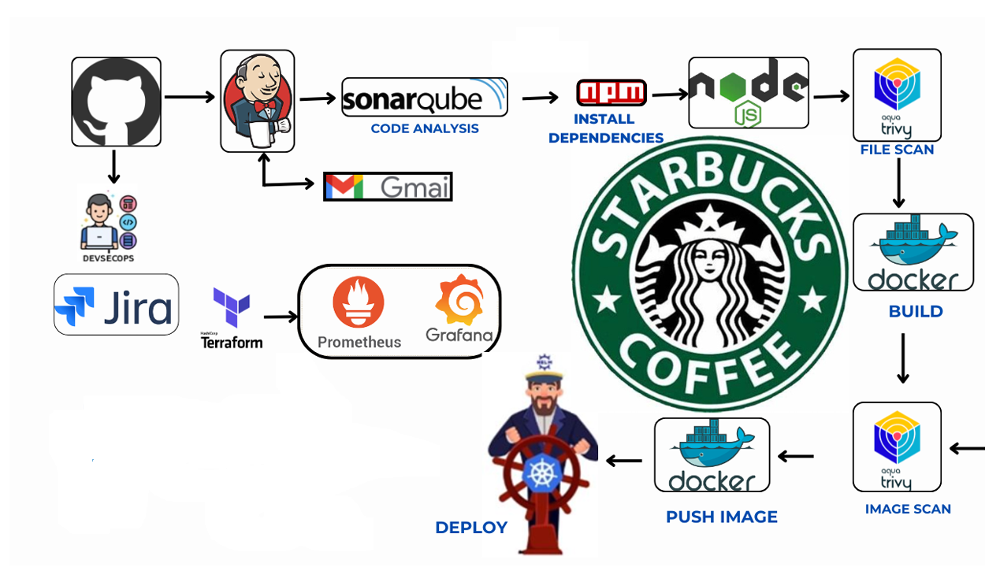 | 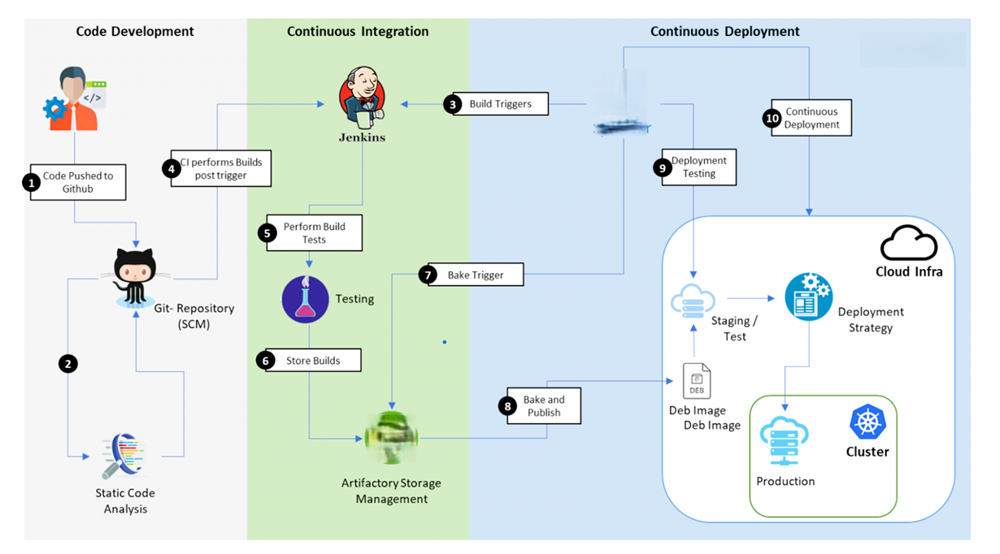 |
| Project Architecture Overview | Project Architecture (Detailed) |

| | |
|---|---|
| 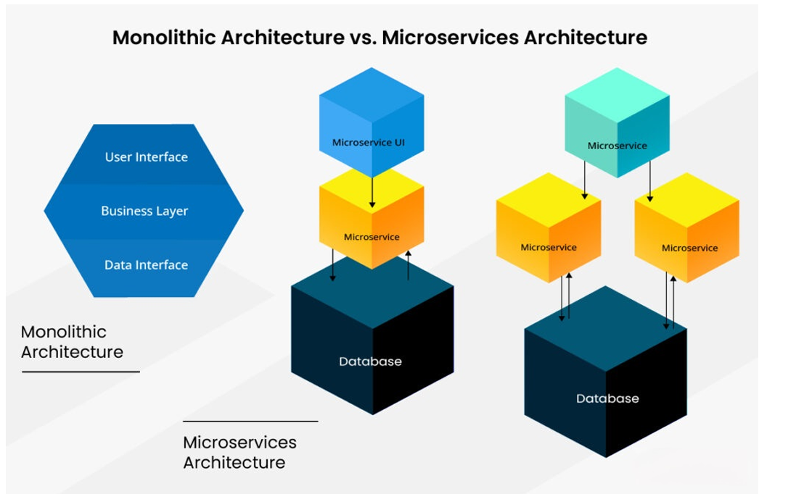 | 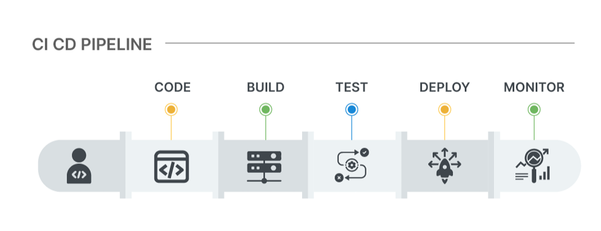 |
| Monolithic vs Microservices Architecture | CI/CD Overview |

| | |
|---|---|
| 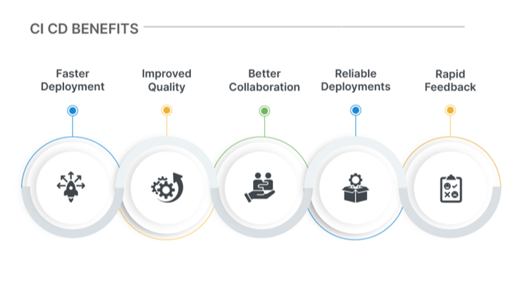 | 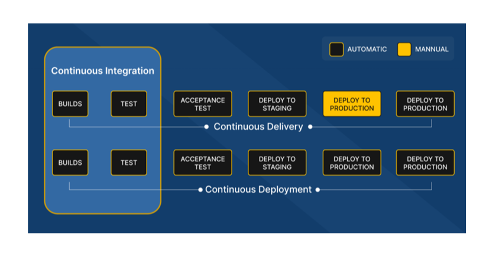 |
| CI/CD Pipeline Stages | CI/CD Flow Detail |

### Kubernetes Architecture

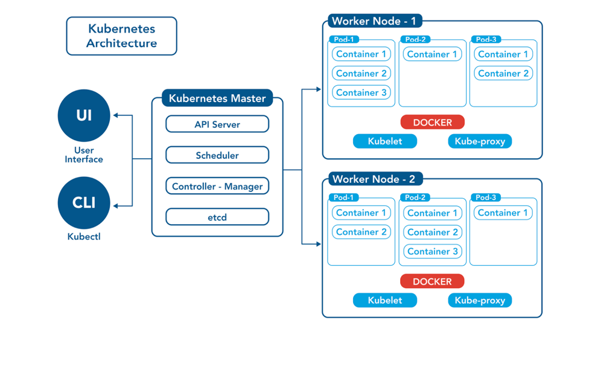

---

## 🔄 CI/CD Pipeline Flow

```
Stage 1 : Git Checkout
          └── Pull latest code from GitHub

Stage 2 : SonarQube Code Analysis
          └── Static analysis → quality gate must pass before proceeding

Stage 3 : npm Install & Node.js Build
          └── Install all npm dependencies and build the application

Stage 4 : Trivy Filesystem Scan
          └── Scan source code and node_modules for known vulnerabilities

Stage 5 : Docker Build
          └── Build Docker image from the project Dockerfile

Stage 6 : Trivy Docker Image Scan
          └── Scan the built image for OS & library vulnerabilities

Stage 7 : Push Image to DockerHub
          └── Tag and push the verified image to the DockerHub registry

Stage 8 : Deploy to Kubernetes (AWS EKS)
          └── kubectl apply → creates Deployment + LoadBalancer Service on EKS

Stage 9 : Email Notification
          └── Send build success/failure email via Jenkins SMTP (Gmail)
```

---

## 🛠️ Technology Stack

| Category | Tool / Service | Purpose |
|---|---|---|
| **Source Control** | GitHub | Code repository & version control |
| **CI/CD Orchestration** | Jenkins | Pipeline automation — all stages |
| **Code Quality** | SonarQube | Static analysis & quality gate |
| **Security Scanning** | Trivy | Filesystem + Docker image vulnerability scanning |
| **Containerization** | Docker | Build and run container images |
| **Container Registry** | DockerHub | Store and distribute Docker images |
| **Container Orchestration** | Kubernetes (AWS EKS) | Deploy, scale, and manage containers |
| **Cloud Provider** | AWS | EC2, EKS, IAM, S3, DynamoDB |
| **Infrastructure as Code** | Terraform | Provision all cloud infrastructure |
| **Terraform State Backend** | AWS S3 + DynamoDB | Remote state storage & state locking |
| **Monitoring** | Prometheus | Scrape and store metrics |
| **Dashboards** | Grafana | Visualize metrics with dashboards |
| **Uptime / URL Probing** | Blackbox Exporter | Probe HTTP/HTTPS endpoints for availability |
| **Email Alerting** | Jenkins SMTP via Gmail | Send build result notifications |
| **Application Runtime** | Node.js | Run the Starbucks web application |
| **Package Manager** | npm | Install and manage Node.js dependencies |
| **DNS / Load Balancing** | AWS ELB (via K8s Service) | Expose the app via a public DNS endpoint |

---

## 🏗️ AWS Infrastructure Overview

```
AWS Account
│
├── IAM
│   └── User: starbuck
│       ├── Policies: EC2, EKS, S3, DynamoDB, IAM (required permissions)
│       └── Access Key + Secret Access Key  (for CLI & Jenkins)
│
├── EC2 Instances
│   ├── starbuck-server           (manually created)
│   │   ├── Role: Jenkins master + Docker + all CLI tools
│   │   ├── AMI:  Ubuntu (Latest LTS)
│   │   ├── Storage: 30 GB
│   │   └── Security Group Ports: 22, 80, 443, 8080, 587, 465, 3000
│   │
│   ├── sonarqube-server          (Terraform provisioned)
│   │   ├── Role: SonarQube (runs as Docker container)
│   │   └── Port: 9000
│   │
│   └── monitoring-server         (Terraform provisioned)
│       ├── Role: Prometheus + Grafana + Blackbox Exporter
│       └── Ports: 9090 (Prometheus), 3000 (Grafana), 9115 (Blackbox Exporter)
│
├── AWS EKS Cluster: starbucks-eks-cluster   (Terraform provisioned)
│   ├── Region: ap-south-1
│   └── Node Group: 2 Worker Nodes
│
└── Terraform Remote Backend
    ├── S3 Bucket      ── stores terraform.tfstate
    └── DynamoDB Table ── state locking (prevents concurrent apply conflicts)
```

---

## 🔒 Security Group Ports Reference

> Ports configured on the **starbuck-server** EC2 security group.

| Port | Protocol | Service |
|---|---|---|
| `22` | SSH | Secure shell access to EC2 |
| `80` | HTTP | Standard web traffic |
| `443` | HTTPS | Secure web traffic |
| `587` | SMTP (TLS) | Jenkins email alerts — Gmail outbound |
| `465` | SMTPS | Jenkins extended email — Gmail outbound |
| `3000` | TCP | Starbucks Application (Node.js) |
| `8080` | TCP | Jenkins CI/CD web interface |

> Additional ports on separate servers:

| Port | Server | Service |
|---|---|---|
| `9000` | sonarqube-server | SonarQube web interface |
| `9090` | monitoring-server | Prometheus |
| `3000` | monitoring-server | Grafana *(separate EC2 from the app)* |
| `9115` | monitoring-server | Blackbox Exporter |

---

## ✅ Prerequisites

Before starting this project, ensure you have:

- ✅ An **AWS Account** with billing enabled
- ✅ A **GitHub account** — fork or clone this repository
- ✅ A **DockerHub account** — Personal Access Token generated
- ✅ A **Gmail account** — App Password created (not your regular Gmail password)
- ✅ Basic familiarity with Linux CLI, Docker, Kubernetes, Jenkins, and Terraform

---

## 🚀 Step-by-Step Setup Guide

---

### Step 1 — Create AWS IAM User

1. Log in to the **AWS Management Console**
2. Navigate to **IAM → Users → Create User**
3. Set the username as `starbuck`
4. Attach the required policies (EC2, EKS, S3, IAM, DynamoDB full access)
5. Complete the user creation wizard

| | | |
|---|---|---|
| 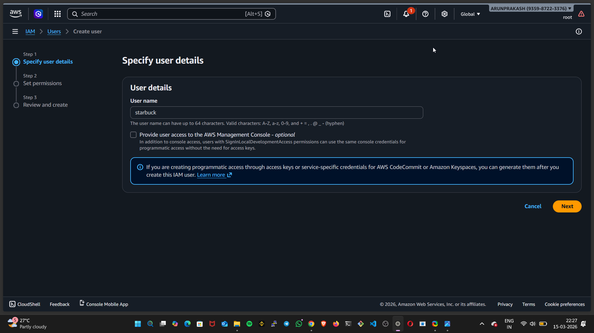 | 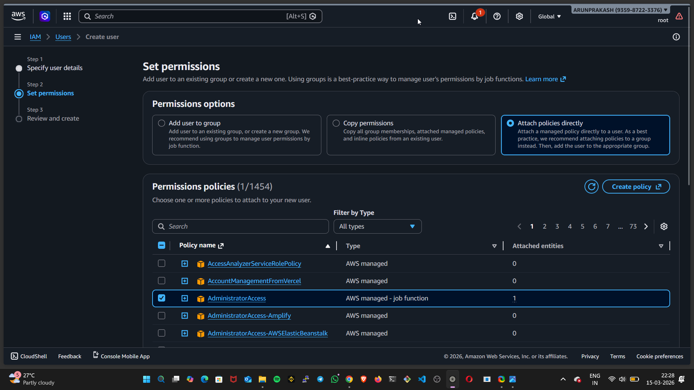 | 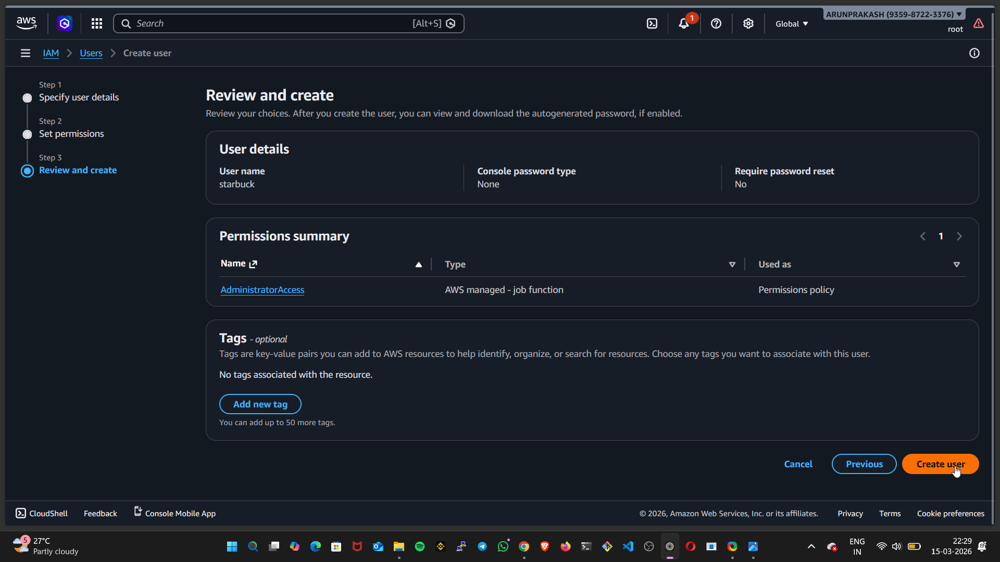 |
| IAM → Create User | Attach Policies to User | Review & Create |

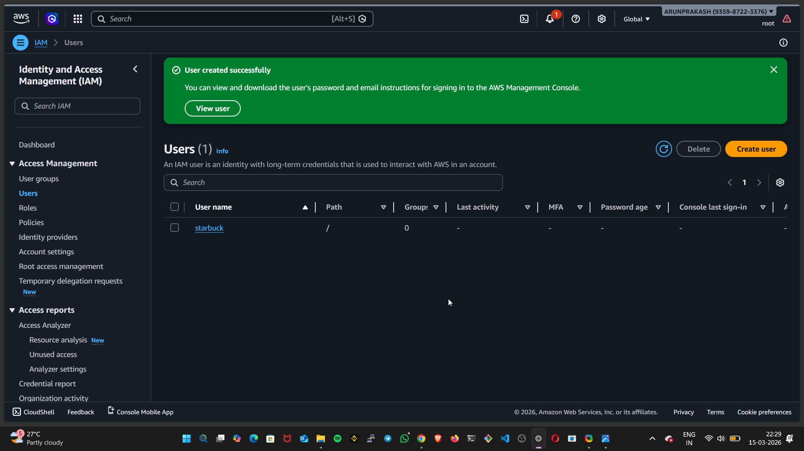
*IAM user `starbuck` created successfully*

---

### Step 2 — Generate IAM Access Keys

1. Go to **IAM → Users → starbuck → Security Credentials** tab
2. Scroll to **Access Keys** section → Click **Create Access Key**
3. Select use case: **Command Line Interface (CLI)**
4. Complete the wizard and **save both the Access Key ID and Secret Access Key** — you cannot retrieve the secret key again after closing this page

| | | |
|---|---|---|
| 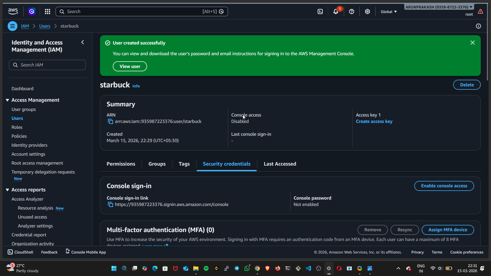 | 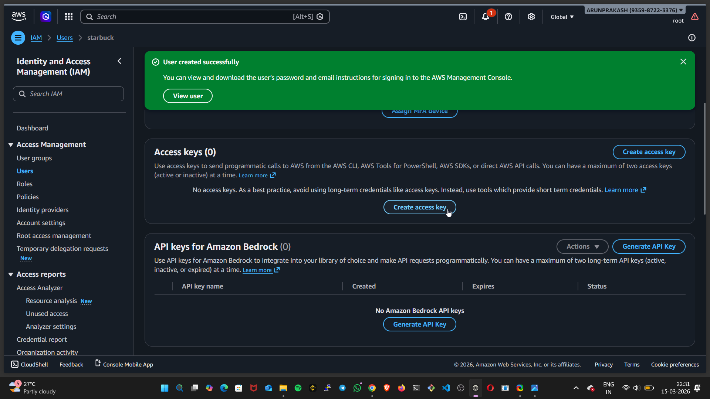 | 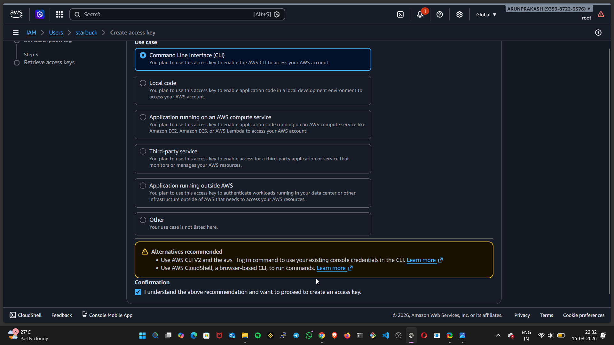 |
| Security Credentials Tab | Create Access Key — Step 1 | Create Access Key — Step 2 |

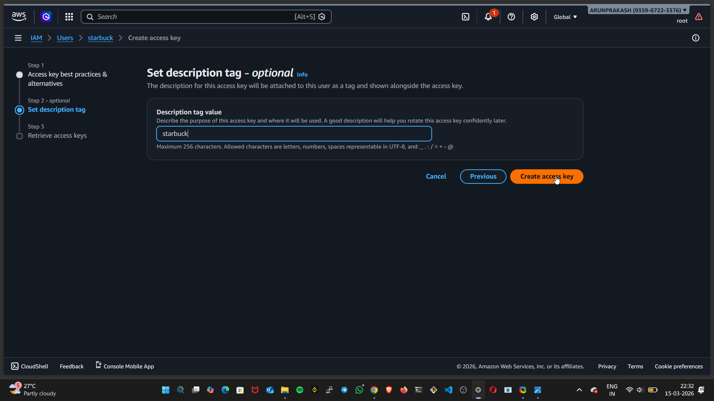
*Access Key and Secret Access Key created successfully — save these values securely*

---

### Step 3 — Launch EC2 Instance (starbuck-server)

Create the main Jenkins server EC2 instance with the following configuration:

| Parameter | Value |
|---|---|
| **Instance Name** | `starbuck-server` |
| **AMI** | Ubuntu (Latest LTS) |
| **Storage** | 30 GB |
| **Security Group Inbound Ports** | 22, 80, 443, 8080, 587, 465, 3000 |

| | |
|---|---|
| 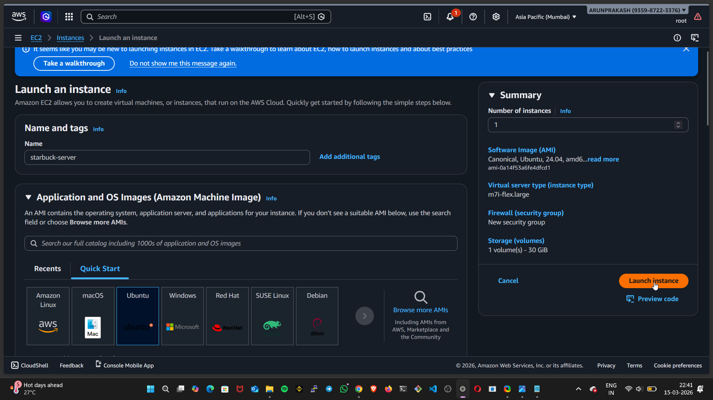 | 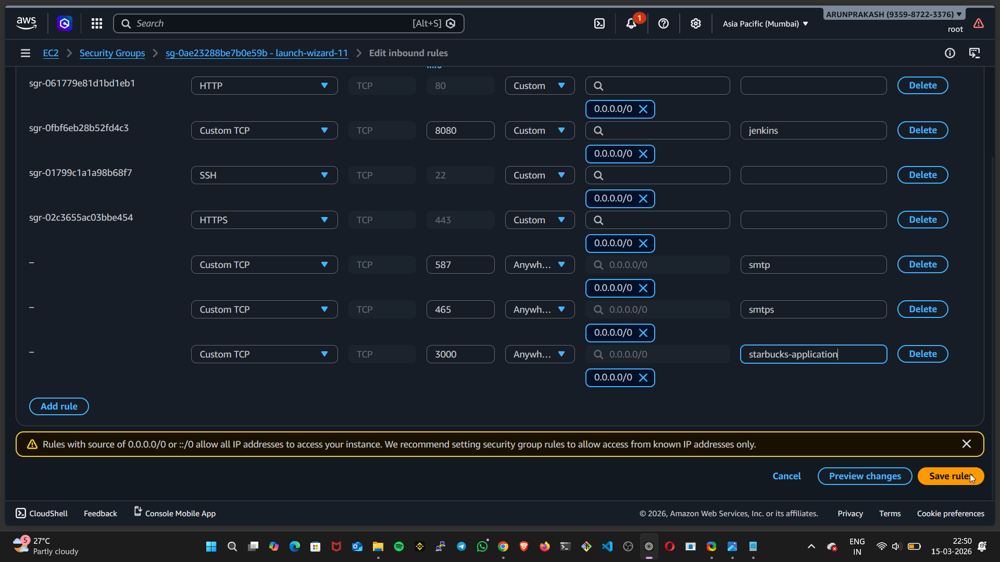 |
| EC2 Instance Created | Security Group Port Configuration |

**SSH into the instance:**

```bash
ssh -i your-key.pem ubuntu@<STARBUCK-SERVER-PUBLIC-IP>
```

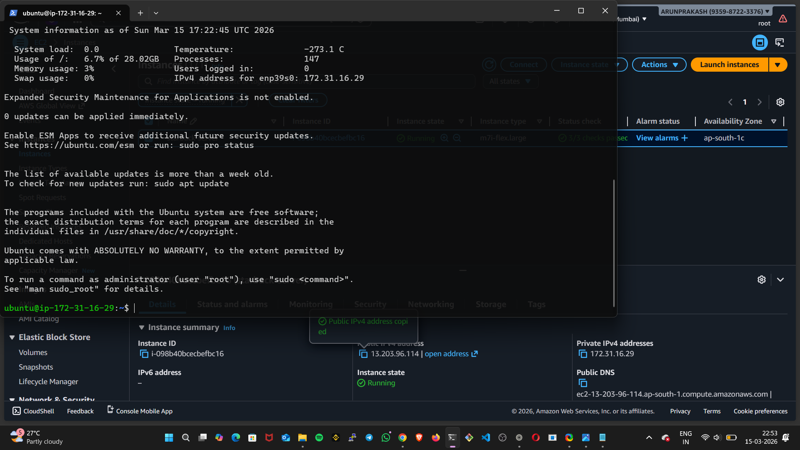
*Successfully logged into starbuck-server via SSH*

---

### Step 4 — Install All Required Tools

Install all required tools on the `starbuck-server` instance.

#### Jenkins
> Official Docs: https://www.jenkins.io/doc/book/installing/linux/

```bash
sudo apt update
sudo apt install -y openjdk-21-jdk
curl -fsSL https://pkg.jenkins.io/debian/jenkins.io-2023.key | \
  sudo tee /usr/share/keyrings/jenkins-keyring.asc > /dev/null
echo deb [signed-by=/usr/share/keyrings/jenkins-keyring.asc] \
  https://pkg.jenkins.io/debian binary/ | \
  sudo tee /etc/apt/sources.list.d/jenkins.list > /dev/null
sudo apt update && sudo apt install -y jenkins
sudo systemctl enable jenkins
sudo systemctl start jenkins
```

#### Docker
> Official Docs: https://docs.docker.com/engine/install/ubuntu/

```bash
sudo apt install -y docker.io
sudo systemctl enable docker
sudo systemctl start docker
sudo usermod -aG docker ubuntu
```

#### Trivy
> Official Docs: https://trivy.dev/docs/latest/getting-started/installation/

```bash
sudo apt-get install -y wget apt-transport-https gnupg lsb-release
wget -qO - https://aquasecurity.github.io/trivy-repo/deb/public.key | sudo apt-key add -
echo deb https://aquasecurity.github.io/trivy-repo/deb $(lsb_release -sc) main \
  | sudo tee /etc/apt/sources.list.d/trivy.list
sudo apt-get update && sudo apt-get install -y trivy
```

#### Terraform
> Official Docs: https://developer.hashicorp.com/terraform/tutorials/aws-get-started/install-cli

```bash
sudo snap install terraform --classic
```

#### AWS CLI
> Official Docs: https://docs.aws.amazon.com/cli/latest/userguide/getting-started-install.html

```bash
sudo snap install aws-cli --classic
```

#### kubectl
> Official Docs: https://kubernetes.io/docs/tasks/tools/install-kubectl-linux/

```bash
sudo snap install kubectl --classic
```

#### Configure AWS CLI (ubuntu user)

```bash
aws configure
# Access Key ID:     <your-starbuck-iam-access-key>
# Secret Access Key: <your-starbuck-iam-secret-key>
# Default region:    ap-south-1
# Output format:     json
```

#### eksctl
> Official Docs: https://docs.aws.amazon.com/eks/latest/eksctl/installation.html

```bash
ARCH=amd64
PLATFORM=$(uname -s)_$ARCH
curl -sLO "https://github.com/eksctl-io/eksctl/releases/latest/download/eksctl_$PLATFORM.tar.gz"
tar -xzf eksctl_$PLATFORM.tar.gz -C /tmp
sudo mv /tmp/eksctl /usr/local/bin
eksctl version
```

---

### Step 5 — Access Jenkins & Install Plugins

**Get the Jenkins initial admin password:**

```bash
sudo cat /var/lib/jenkins/secrets/initialAdminPassword
```

**Access Jenkins in your browser:**

```
http://<STARBUCK-SERVER-PUBLIC-IP>:8080
```

| | |
|---|---|
| 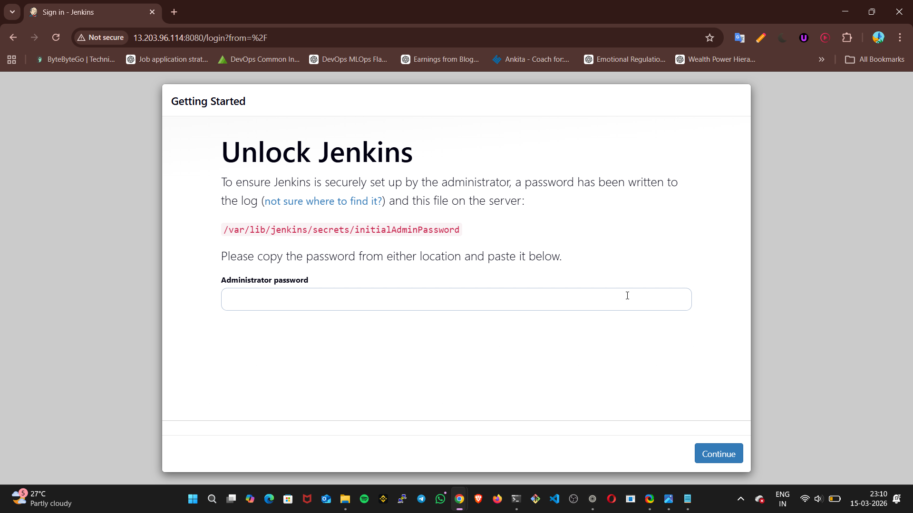 | 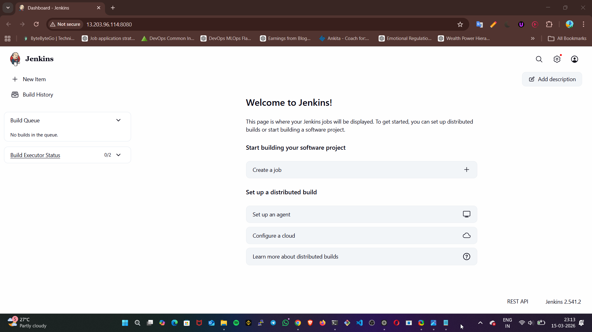 |
| Jenkins Login Page | Jenkins Initial Setup Wizard |

**Install the following required plugins:**

Go to **Manage Jenkins → Plugins → Available Plugins**, search for and install:

| Category | Plugin Names |
|---|---|
| **Java** | Eclipse Temurin Installer |
| **Node.js** | NodeJS |
| **Pipeline UI** | Pipeline Stage View |
| **Docker** | Docker, Docker Commons, Docker Pipeline, Docker API, Docker Build Step |
| **SonarQube** | SonarQube Scanner |
| **Kubernetes** | Kubernetes, Kubernetes Client API, Kubernetes CLI, Kubernetes Credentials |

After installing all plugins, **restart Jenkins**.

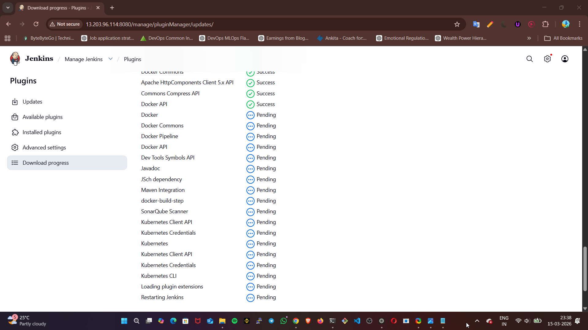
*Installing all required Jenkins plugins*

---

### Step 6 — Configure Jenkins Email Alerts

#### Generate Gmail App Password

1. Go to your Gmail account → click your **Profile icon → Manage your Google Account**
2. In the search bar, type **"App Passwords"**
3. Create a new App Password (e.g., name it `jenkins`)
4. **Copy the generated 16-character app password**

> ⚠️ **Important:** Always use the App Password in Jenkins — never your real Gmail password.

#### Configure Email Notification (SMTP)

Go to **Manage Jenkins → System → E-mail Notification:**

| Setting | Value |
|---|---|
| SMTP Server | `smtp.gmail.com` |
| Default Email Suffix | `@gmail.com` |
| Use SMTP Authentication | ✅ Enabled |
| Username | `your-gmail-address@gmail.com` |
| Password | `<your-gmail-app-password>` |
| Use TLS | ✅ Enabled |
| SMTP Port | `587` |
| Reply-To Address | `your-gmail-address@gmail.com` |

Click **Test Configuration**, then **Apply & Save**.

#### Configure Extended E-mail Notification (SMTPS)

Go to **Manage Jenkins → System → Extended E-mail Notification:**

| Setting | Value |
|---|---|
| SMTP Server | `smtp.gmail.com` |
| SMTPS Port | `465` |
| Default Email Suffix | `@gmail.com` |
| Credentials | Add → Username: your Gmail, Password: App Password, ID: `starbucks-gmail` |

Click **Apply & Save**.

---

### Step 7 — Add Docker Permissions to Jenkins

Allow the Jenkins process user to run Docker commands:

```bash
sudo usermod -aG docker jenkins
sudo systemctl restart jenkins
```

> **Note:** Jenkins plugin setup and email configuration are now done. The remaining Jenkins credential/tool configuration (Step 12) will be completed after the SonarQube and Terraform steps below. We provision infrastructure in parallel next.

---

### Step 8 — Terraform Backend Setup (S3 + DynamoDB)

Clone the project repository on `starbuck-server`:

```bash
git clone https://github.com/arunprakash432/deploy-starbucks-application-project.git
cd deploy-starbucks-application-project
```

Create the **S3 bucket** (Terraform state storage) and **DynamoDB table** (state locking):

```bash
cd backend/
terraform init
terraform apply
# Type 'yes' when prompted
```

| | | |
|---|---|---|
| 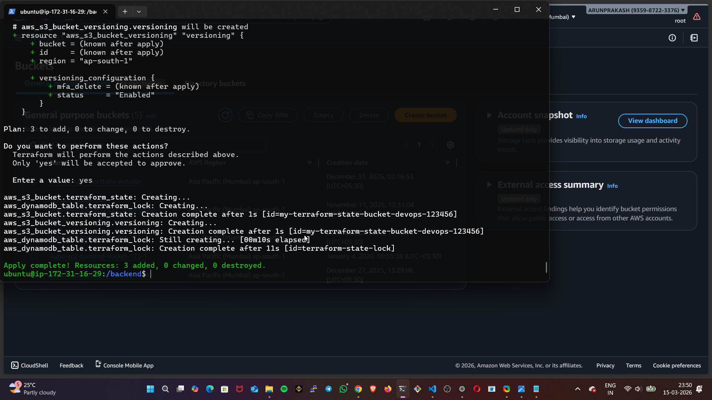 | 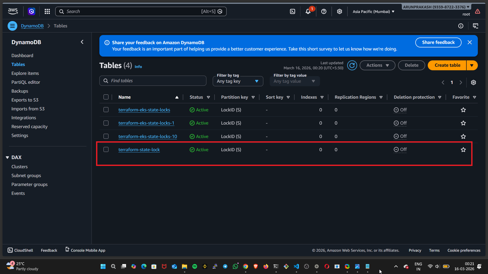 | 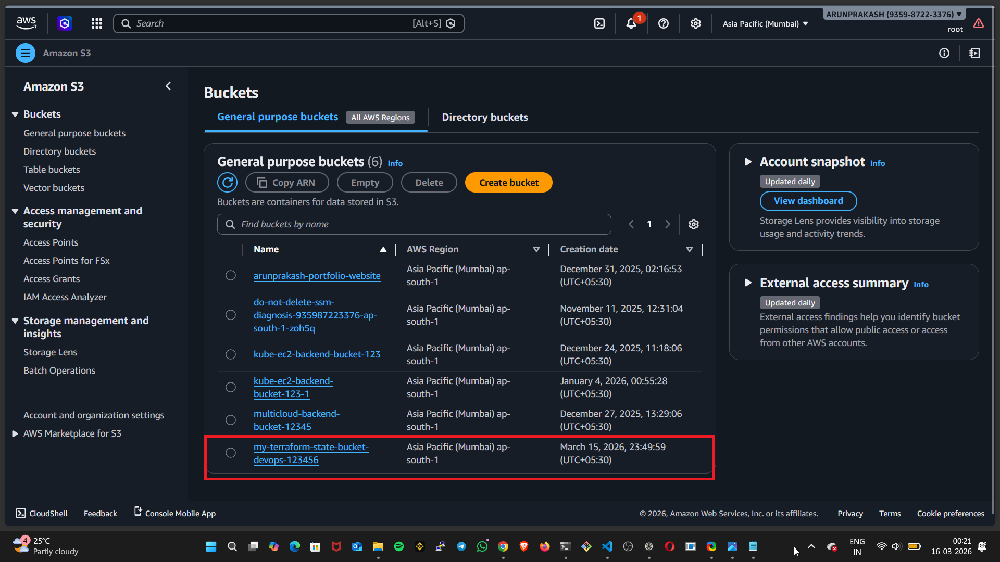 |
| S3 + DynamoDB State Locking Setup | DynamoDB State Lock Table | S3 Bucket for Terraform State |

---

### Step 9 — Provision Infrastructure with Terraform

Run the main Terraform configuration to provision all remaining infrastructure:

```bash
cd ../terraform/
terraform init
terraform plan
terraform apply
# Type 'yes' when prompted
```

This creates:
- **sonarqube-server** — EC2 instance for running SonarQube
- **monitoring-server** — EC2 instance for Prometheus, Grafana, and Blackbox Exporter
- **starbucks-eks-cluster** — AWS EKS cluster with a **2-node NodeGroup** in `ap-south-1`

| | |
|---|---|
| 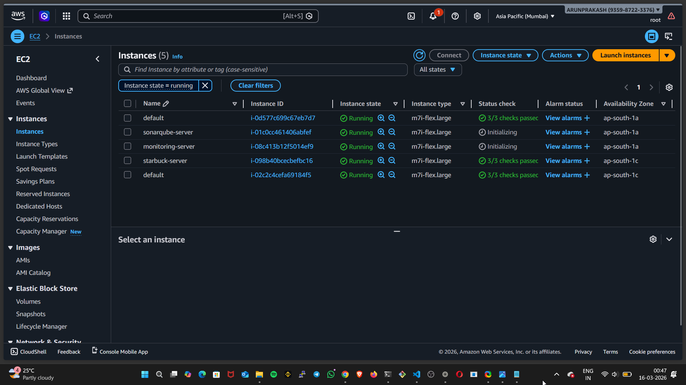 | 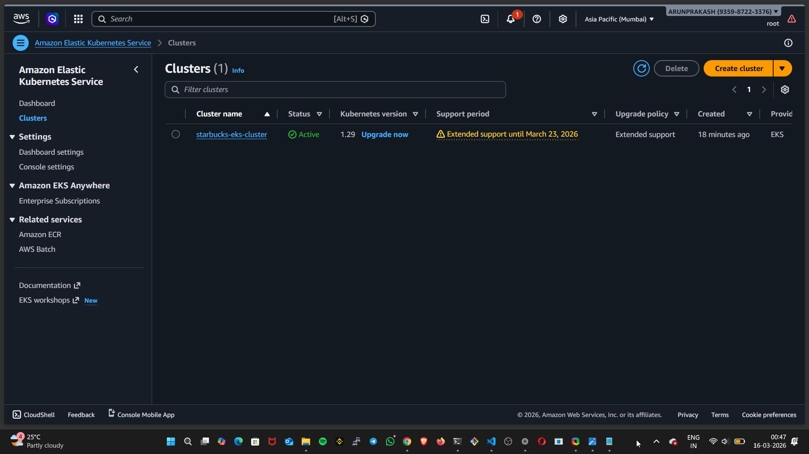 |
| SonarQube & Monitoring EC2 Instances Provisioned | EKS Cluster `starbucks-eks-cluster` Provisioned |

---

### Step 10 — Setup SonarQube Server

SSH into the **sonarqube-server** EC2 instance (get its public IP from AWS Console or Terraform output).

**Install Docker on the SonarQube server:**

```bash
# Official Docs: https://docs.docker.com/engine/install/ubuntu/
sudo apt update && sudo apt install -y docker.io
sudo usermod -aG docker ubuntu
sudo systemctl enable docker && sudo systemctl start docker
```

**Run SonarQube as a Docker container:**

```bash
docker run -d \
  --name sonarqube \
  -p 9000:9000 \
  sonarqube:community
```

**Access SonarQube in your browser:**

```
http://<SONARQUBE-SERVER-PUBLIC-IP>:9000
```

Default credentials: `admin` / `admin` — **change your password immediately on first login.**

| | |
|---|---|
| 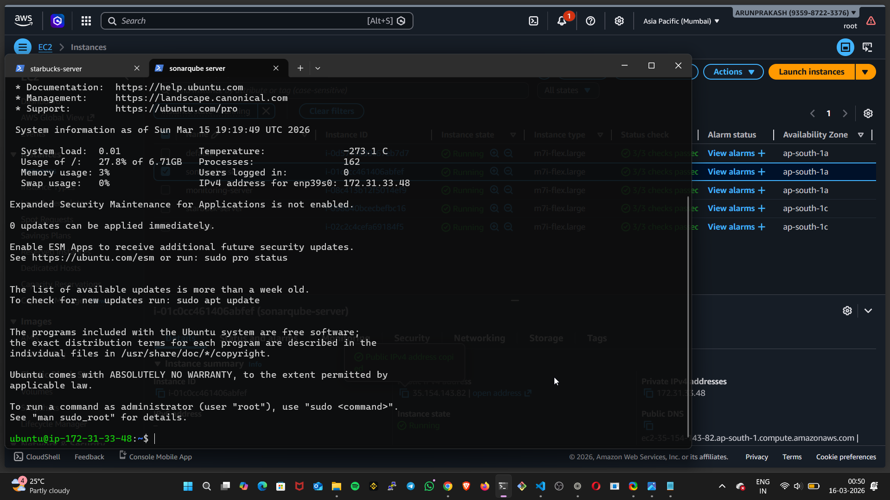 | 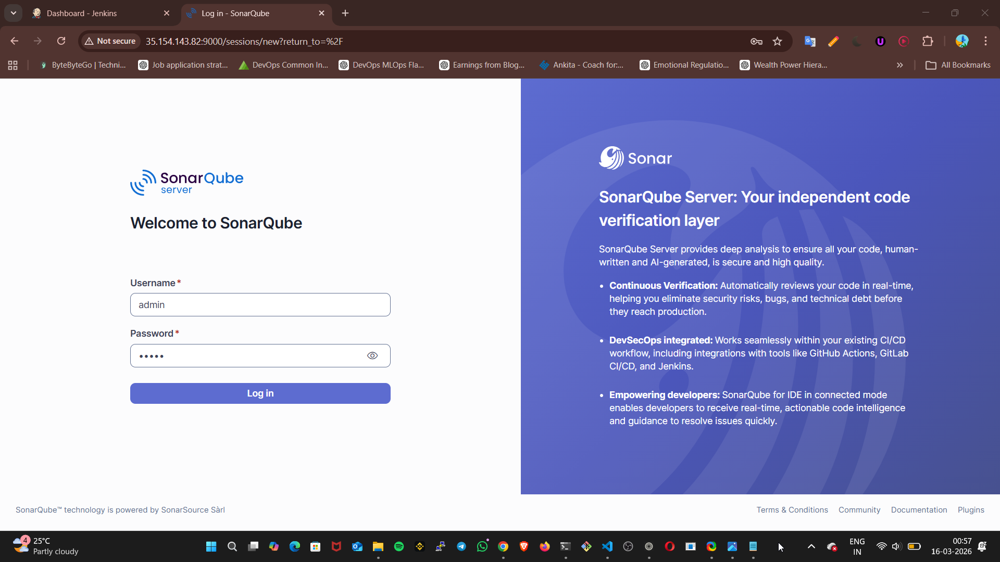 |
| SSH into SonarQube Server | SonarQube Dashboard in Browser |

---

### Step 11 — Generate SonarQube Token & Configure Webhook

#### Generate SonarQube Analysis Token

1. In SonarQube → click your **profile icon (top right) → My Account**
2. Go to the **Security** tab
3. Under **Generate Tokens**, provide a name (e.g., `jenkins-token`)
4. Token Type: **Global Analysis Token**
5. Click **Generate** — **copy and save this token immediately**

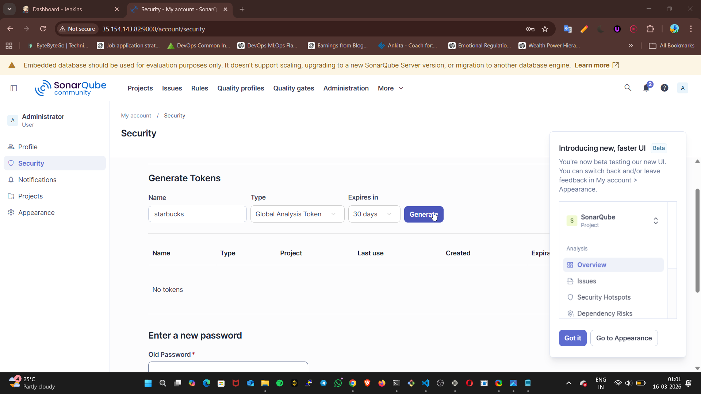
*SonarQube Global Analysis Token generated — copy before closing*

#### Add SonarQube Webhook (notifies Jenkins when quality gate completes)

In SonarQube → **Administration → Configuration → Webhooks → Create:**

| Setting | Value |
|---|---|
| Name | `jenkins` |
| URL | `http://<STARBUCK-SERVER-PUBLIC-IP>:8080/sonarqube-webhook/` |

Click **Create**.

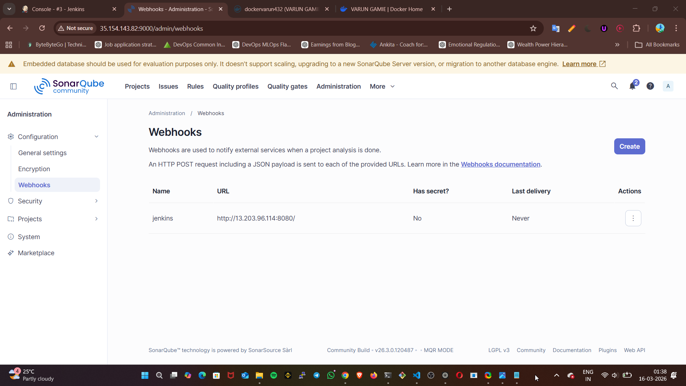
*SonarQube webhook configured to notify Jenkins of quality gate results*

---

### Step 12 — Configure Jenkins Tools & Credentials

#### Configure Global Tools

Go to **Manage Jenkins → Tools:**

**JDK:**
- Add JDK → Name: `jdk21`
- ✅ Install automatically → from `adoptium.net` → select `jdk-21`

**NodeJS:**
- Add NodeJS → Name: `node18`
- ✅ Install automatically → select the required Node.js version

**SonarQube Scanner:**
- Add SonarQube Scanner → Name: `sonar-scanner`
- ✅ Install automatically

Click **Apply & Save**.

#### Add SonarQube Server in Jenkins

Go to **Manage Jenkins → System → SonarQube Servers → Add SonarQube:**

| Setting | Value |
|---|---|
| Name | `sonar-server` |
| Server URL | `http://<SONARQUBE-SERVER-PUBLIC-IP>:9000` |
| Server Authentication Token | Add the SonarQube token as a **Secret Text** credential |

Click **Apply & Save**.

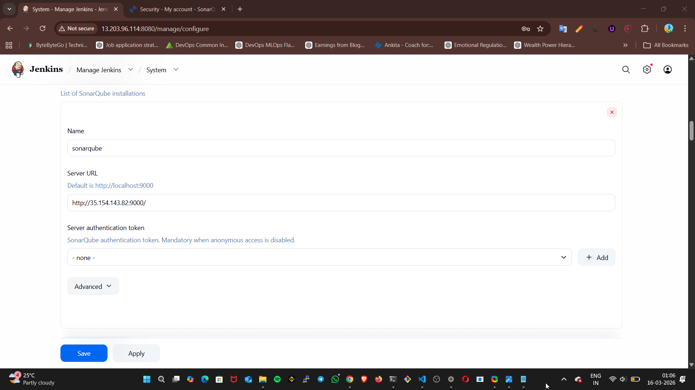
*SonarQube server added to Jenkins system configuration*

#### Generate DockerHub Personal Access Token

1. Log in to **DockerHub → Account Settings → Security → Personal Access Tokens**
2. Click **Generate New Token** → give it a name (e.g., `jenkins`) → generate
3. **Copy the token** — it is shown only once

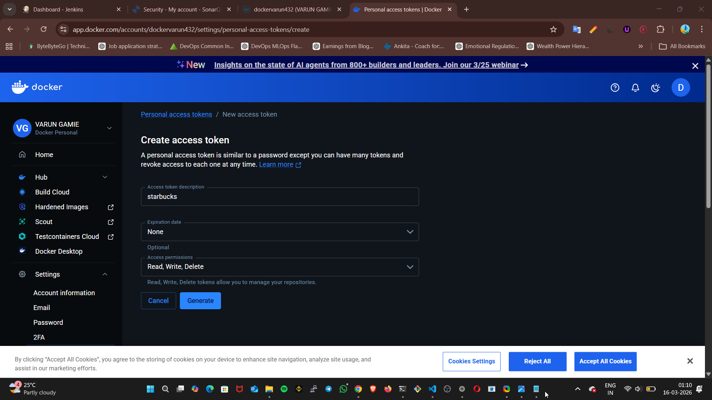
*DockerHub Personal Access Token generated*

#### Add All Credentials to Jenkins

Go to **Manage Jenkins → Credentials → System → Global Credentials → Add Credentials:**

| Credential ID | Kind | Value |
|---|---|---|
| `sonar-token` | Secret Text | SonarQube Global Analysis Token |
| `docker-credentials` | Username with Password | DockerHub username + PAT token |
| `starbucks-gmail` | Username with Password | Gmail address + Gmail App Password |

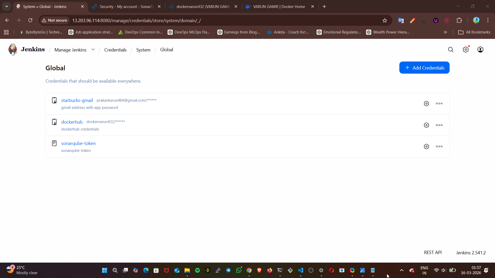
*All credentials added to Jenkins*

---

### Step 13 — Configure AWS CLI in Jenkins User

Set a password for the Jenkins OS user and configure AWS so the pipeline can interact with EKS:

```bash
# Set a password for the jenkins system user
sudo passwd jenkins

# Switch to the jenkins user
su - jenkins

# Verify the current user
whoami    # expected output: jenkins
pwd       # expected output: /var/lib/jenkins

# Configure AWS credentials for the jenkins user
aws configure
# Access Key ID:     <your-starbuck-iam-access-key>
# Secret Access Key: <your-starbuck-iam-secret-key>
# Default region:    ap-south-1
# Output format:     json

# Verify the credentials are working correctly
aws sts get-caller-identity
```

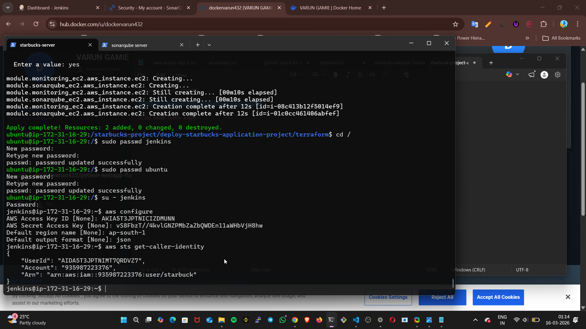
*AWS CLI configured and verified for the Jenkins user*

---

### Step 14 — Connect EKS Cluster & Run the Pipeline

**Still as the `jenkins` user**, update kubeconfig to point to your EKS cluster:

```bash
aws eks update-kubeconfig \
  --region ap-south-1 \
  --name starbucks-eks-cluster

# Verify the cluster connection
kubectl get nodes
kubectl get namespaces
```

**Now trigger the Jenkins pipeline:**

1. Open Jenkins in your browser → navigate to your pipeline job
2. Click **Build Now**
3. Monitor each stage in the Stage View

The pipeline executes all stages automatically:
> Checkout → SonarQube Analysis → npm Build → Trivy FS Scan → Docker Build → Trivy Image Scan → DockerHub Push → K8s Deploy → Email Notification

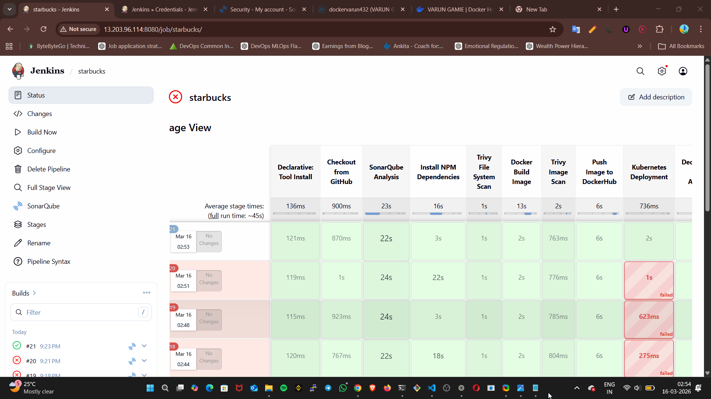
*Jenkins pipeline completed — all stages passed successfully*

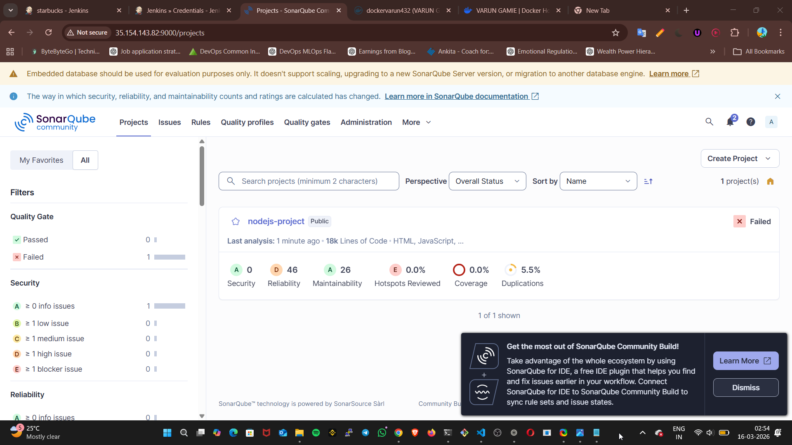
*SonarQube quality gate passed*

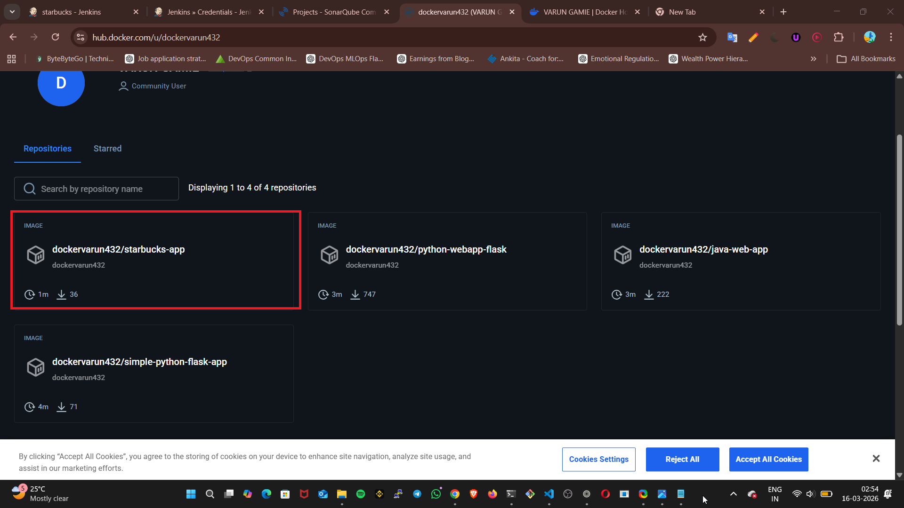
*Docker image built and pushed to DockerHub successfully*

---

### Step 15 — Verify Kubernetes Deployment

```bash
# Check pods are running
kubectl get pods

# Check deployment status
kubectl get deployments

# Get the LoadBalancer external DNS / IP
kubectl get services
```

Copy the **EXTERNAL-IP** from the service output and open it in your browser. The Starbucks application should be live.

| | |
|---|---|
| 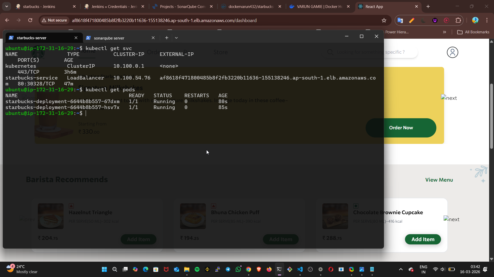 | 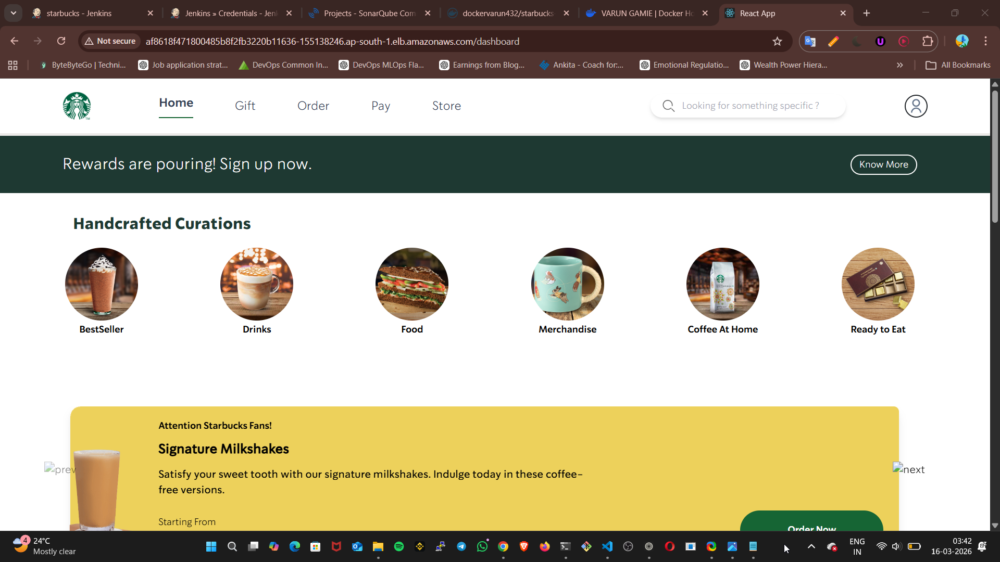 |
| Kubernetes Pods & Services Verified | Starbucks App Live via LoadBalancer DNS |

---

### Step 16 — Setup Monitoring (Prometheus, Grafana, Blackbox Exporter)

SSH into the **monitoring-server** EC2 instance (get its public IP from AWS Console or Terraform output).

#### Install Prometheus (Port: 9090)

```bash
wget https://github.com/prometheus/prometheus/releases/download/v2.51.0/prometheus-2.51.0.linux-amd64.tar.gz
tar -xvf prometheus-2.51.0.linux-amd64.tar.gz
cd prometheus-2.51.0.linux-amd64/
./prometheus --config.file=prometheus.yml &
```

Access: `http://<MONITORING-SERVER-IP>:9090`

#### Install Grafana (Port: 3000)

```bash
sudo apt-get install -y adduser libfontconfig1 musl
wget https://dl.grafana.com/oss/release/grafana_10.4.0_amd64.deb
sudo dpkg -i grafana_10.4.0_amd64.deb
sudo systemctl start grafana-server
sudo systemctl enable grafana-server
```

Access: `http://<MONITORING-SERVER-IP>:3000`
Default login: `admin` / `admin`

#### Install Blackbox Exporter (Port: 9115)

```bash
wget https://github.com/prometheus/blackbox_exporter/releases/download/v0.25.0/blackbox_exporter-0.25.0.linux-amd64.tar.gz
tar -xvf blackbox_exporter-0.25.0.linux-amd64.tar.gz
cd blackbox_exporter-0.25.0.linux-amd64/
./blackbox_exporter &
```

Access: `http://<MONITORING-SERVER-IP>:9115`

#### Configure Prometheus to Probe the Application (via Blackbox Exporter)

Add the following job to `prometheus.yml`:

```yaml
scrape_configs:
  - job_name: 'blackbox'
    metrics_path: /probe
    params:
      module: [http_2xx]
    static_configs:
      - targets:
          - http://<STARBUCKS-LOADBALANCER-DNS>
    relabel_configs:
      - source_labels: [__address__]
        target_label: __param_target
      - source_labels: [__param_target]
        target_label: instance
      - target_label: __address__
        replacement: localhost:9115
```

Restart Prometheus after updating the config.

#### Import Grafana Dashboard

1. Log in to Grafana → **+ → Import Dashboard**
2. Use Dashboard ID `7587` (Blackbox Exporter HTTP) or `3662` (Prometheus 2.0 Stats)
3. Select your Prometheus data source → click **Import**

**Monitoring Screenshots:**

| | | |
|---|---|---|
| 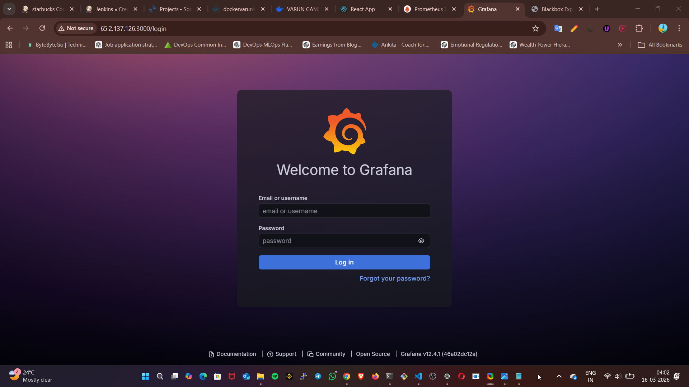 | 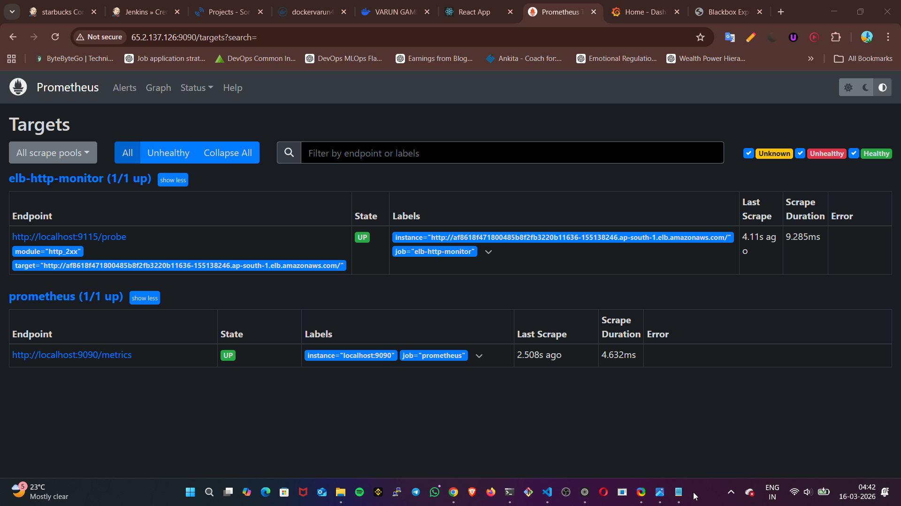 | 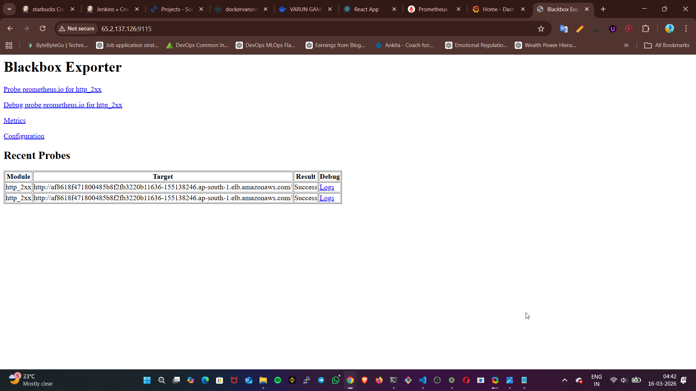 |
| Grafana Login Page | Prometheus Metrics & Targets | Blackbox Exporter Probes |

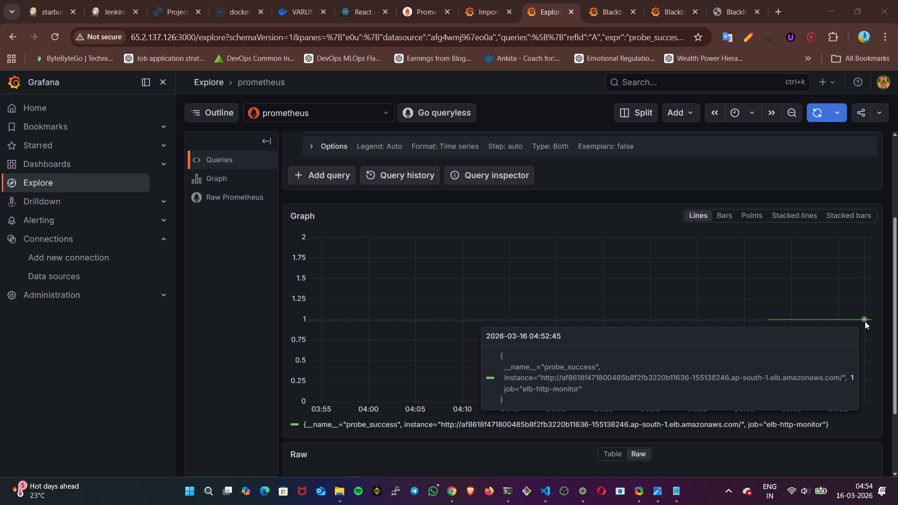
*Grafana dashboard showing application and infrastructure metrics*

---

## 📸 Screenshots Reference

All 43 screenshots are listed below, organized by category in the order they appear throughout the project.

<details>
<summary>📂 Click to expand — All 43 Screenshots</summary>

<br/>

### 🏛️ Architecture & CI/CD Concepts (01–06)

| # | Screenshot | Description |
|---|---|---|
| 01 |  | Starbucks Project Architecture Overview |
| 02 |  | Starbucks Project Architecture (Detailed) |
| 03 |  | Monolithic vs Microservices Architecture |
| 04 |  | CI/CD Pipeline Overview |
| 05 |  | CI/CD Pipeline Stages |
| 06 |  | CI/CD Flow Detail |

### 🔐 AWS IAM Setup (07–14)

| # | Screenshot | Description |
|---|---|---|
| 07 |  | IAM → Create User |
| 08 |  | Attach Required Policies to IAM User |
| 09 |  | Create User — Review & Confirm |
| 10 |  | IAM User `starbuck` Created Successfully |
| 11 |  | Security Credentials Tab |
| 12 |  | Create Access Key — Step 1 |
| 13 |  | Create Access Key — Step 2 |
| 14 |  | Access Key & Secret Key Created |

### 🖥️ EC2 Server & Jenkins Setup (15–20)

| # | Screenshot | Description |
|---|---|---|
| 15 |  | EC2 Instance — `starbuck-server` Created |
| 16 |  | Security Group — Inbound Port Rules |
| 17 |  | SSH Login into `starbuck-server` |
| 18 |  | Jenkins Login Page in Browser |
| 19 |  | Jenkins Initial Setup Wizard |
| 20 |  | Installing Required Jenkins Plugins |

### 🏗️ Terraform — Backend & Infrastructure (21–25)

| # | Screenshot | Description |
|---|---|---|
| 21 |  | S3 + DynamoDB for Terraform State Locking |
| 22 |  | DynamoDB State Lock Table |
| 23 |  | S3 Bucket for Terraform State File |
| 24 |  | SonarQube & Monitoring EC2 Instances Created |
| 25 |  | EKS Cluster `starbucks-eks-cluster` Created |

### ☸️ Kubernetes Architecture (26)

| # | Screenshot | Description |
|---|---|---|
| 26 |  | Kubernetes Architecture Diagram |

### 🧪 SonarQube Setup & Configuration (27–30, 33, 36)

| # | Screenshot | Description |
|---|---|---|
| 27 |  | SSH Login into SonarQube Server |
| 28 |  | SonarQube Dashboard in Browser |
| 29 |  | SonarQube — Generate Global Analysis Token |
| 30 |  | SonarQube Server Configured in Jenkins |
| 33 |  | SonarQube Webhook → Jenkins URL |
| 36 |  | SonarQube Analysis Result — Quality Gate Passed |

### 🔑 DockerHub, AWS & Jenkins Credentials (31–32, 34)

| # | Screenshot | Description |
|---|---|---|
| 31 |  | DockerHub — Generate Personal Access Token |
| 32 |  | AWS CLI Configured for Jenkins User |
| 34 |  | All Credentials Added to Jenkins |

### 🚀 Pipeline Execution & Kubernetes Deployment (35, 37–39)

| # | Screenshot | Description |
|---|---|---|
| 35 |  | Jenkins Pipeline — All Stages Passed |
| 37 |  | Docker Image Successfully Pushed to DockerHub |
| 38 |  | Starbucks App Live via LoadBalancer External IP |
| 39 |  | Kubernetes Pods & Services Verified |

### 📊 Monitoring — Prometheus, Grafana, Blackbox Exporter (40–43)

| # | Screenshot | Description |
|---|---|---|
| 40 |  | Grafana Login Page |
| 41 |  | Prometheus Metrics & Targets |
| 42 |  | Blackbox Exporter Logs & Probe Results |
| 43 |  | Grafana Dashboard — Application & Infra Metrics |

</details>

---

<div align="center">

**Built with ❤️ by [Arunprakash K](https://github.com/arunprakash432)**

⭐ **If this project helped you, please give it a star!**

[](https://github.com/arunprakash432/deploy-starbucks-application-project)
[](https://github.com/arunprakash432/deploy-starbucks-application-project/fork)

</div>
